# Top 25 Cookware Brands Ranked in 2025 (Latest Compilation)

**Introduction:** Modern home chefs want cookware that’s healthy, durable, and easy to use. From **non-toxic cookware** materials to multi-functional designs, today’s top brands tackle pain points like harmful chemicals and tricky cleanup. In this roundup, we explore the leading names helping cooks enjoy safer, more efficient meal prep – without sacrificing style or performance. Expect better heat distribution, **PFAS-free** nonstick surfaces, and quality that stands the test of time.

## [Caraway Home](https://www.carawayhome.com)
*Non-toxic ceramic cookware for healthier home cooking.*

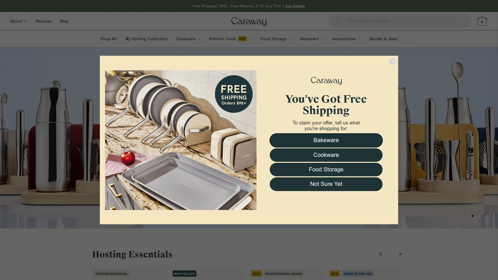

Caraway leads the pack with its ceramic-coated pots and pans that are completely free of PTFE and PFOA. This direct-to-consumer brand emphasizes **health and safety**, using a naturally slick ceramic non-stick surface that requires minimal oil and zero harmful toxins. Home cooks love Caraway’s modern color options and **thoughtful design** – every set comes with magnetic pan racks and canvas lid holders for **clutter-free storage**. It’s an easy-to-use cookware line (oven-safe and compatible with most stovetops) that marries style with peace of mind, perfect for upgrading to a cleaner kitchen setup.

- **Core Features:** PFAS-free ceramic coating, even heat distribution, and dishwasher-safe convenience.
- **Why We Like It:** Ideal for health-conscious cooks seeking an easy-to-clean, design-forward cookware set that doesn’t leach chemicals.

## [GreenPan](https://www.greenpan.us)
*Pioneer of ceramic non-stick technology for eco-friendly cooking.*

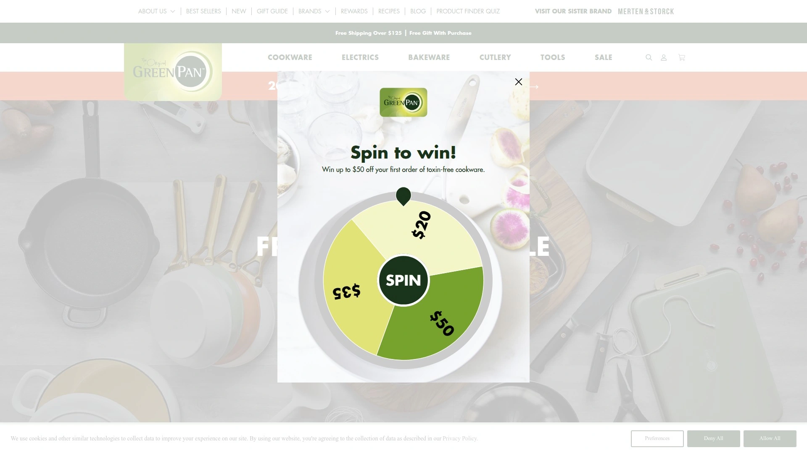

GreenPan put ceramic non-stick on the map, debuting as the first brand to offer a **PFAS-free** coating. Its Thermolon™ ceramic surface provides excellent food release without toxic fumes, even if overheated. GreenPan offers a broad range – from everyday aluminum pans to tri-ply stainless steel sets – all featuring that signature **healthy non-stick** layer. Users praise its quick heating and reliable performance for searing, sautéing, and frying. Plus, GreenPan invests in sustainability (recycled aluminum bodies, toxin-free manufacturing), so you can feel good about using their cookware daily.

## [GreenLife](https://www.greenlife-cookware.com)
*Vibrant, affordable ceramic cookware for everyday healthy meals.*

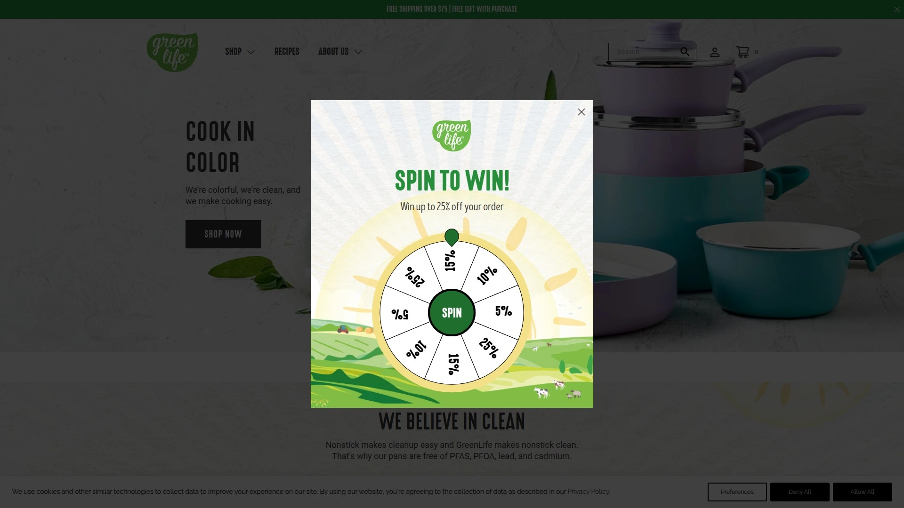

GreenLife is all about making **healthy cooking** accessible. They use the same Thermolon™ ceramic non-stick as GreenPan, but in a colorful, budget-friendly package perfect for beginners or college kitchens. The pans are lightweight and come in fun hues (turquoise, yellow, pink) that add personality to your stove. Despite the lower cost, GreenLife pans are **free of lead, cadmium, PFAS, and PFOA**, ensuring toxin-free meals. They heat quickly for simple dishes like eggs or veggies. While they may not last as long as premium brands, the value is excellent for those starting their cookware collection or seeking an inexpensive non-toxic option.

## [Our Place](https://fromourplace.com)
*All-in-one cookware that blends style, culture, and convenience.*

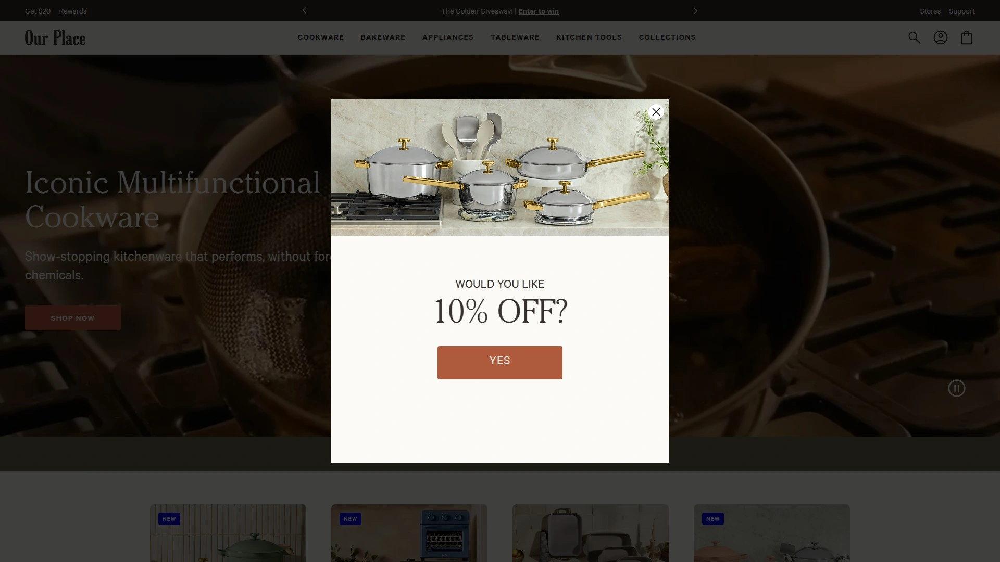

Our Place shook up the scene with its iconic Always Pan – a do-it-all design replacing 8 traditional pieces. This **10-in-1 pan** can sauté, steam, fry, boil, and even looks beautiful for serving. It features a nontoxic ceramic nonstick coating (PFAS-free) and comes with thoughtful add-ons like a steamer basket and beechwood spatula that stores on the handle. Beyond function, Our Place emphasizes multicultural cooking traditions and aesthetically pleasing design (available in earthy tones). It’s perfect for minimalists or those with small kitchens: one attractive piece that handles most daily cooking tasks. From stir-fries to pasta, the Always Pan makes cooking and cleanup effortless, embodying Our Place’s ethos of bringing people together over healthier, home-cooked meals.

## [Great Jones](https://greatjonesgoods.com)
*Playful yet practical cookware for the modern home chef.*

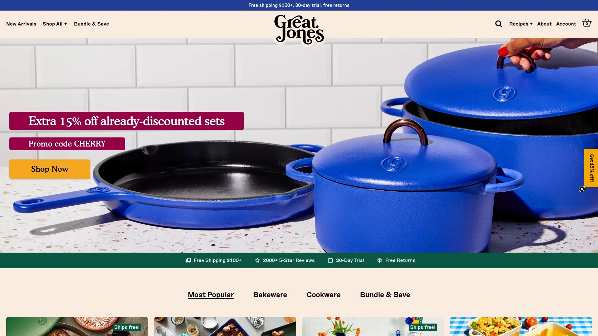

Great Jones is known for its Instagram-worthy cookware that doesn’t compromise on quality. Co-founded by young foodies, this brand offers enameled cast iron and stainless steel pieces with cheeky names – think **“The Dutchess”** (a colorful Dutch oven) or “Big Deal” (stockpot). Great Jones cookware combines **vibrant style with substance**: the enamel Dutch oven rivals legacy brands in heat retention and durability, and their non-stick skillet (“Small Fry”) is made without PFOA. These pieces are built for serious cooking (oven-safe, hefty construction) but also designed to be left on the stovetop for decor. It’s a fantastic choice for cooks who value aesthetics as much as performance, and who want reliable cookware that inspires them to get creative in the kitchen.

- **Notable Strengths:** Eye-catching design, sturdy build, and products that cover all basics from baking sheets to saucepans.
- **Best For:** Home chefs who love to entertain – Great Jones’ pieces transition from oven to table beautifully and spark conversation.

## [HexClad](https://hexclad.com)
*Innovative hybrid pans mixing stainless steel and non-stick.*

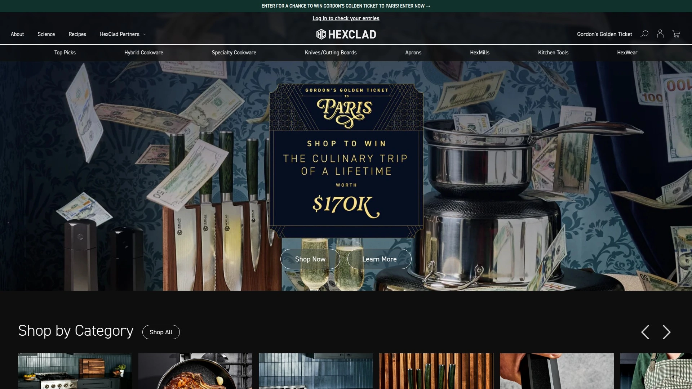

HexClad’s cookware is a game-changer for those torn between stainless steel and nonstick. Its patented design features a unique laser-etched **hexagon pattern**: stainless steel peaks for durable searing, and non-stick valleys for easy food release. This hybrid construction means you can use metal utensils and even scrub pads without ruining the surface – a huge plus in longevity. HexClad pans heat evenly and work on all cooktops (they’re induction-ready thanks to a magnetic steel layer). Many pro chefs, including Michelin-starred ones, have embraced HexClad for its balance of convenience and performance. If you want a pan that can **brown a steak to perfection** yet wipe clean with minimal effort, HexClad fits the bill. It’s an investment, but backed by a lifetime warranty and the promise of cookware that truly lasts.

- **Highlights:** Scratch-resistant hybrid surface, oven-safe up to high temps, and stylish laser-etched look.
- **User Tip:** Preheat properly and use a little oil to maximize the sear on proteins – you’ll get results comparable to a stainless pan, with easier cleanup.

## [Made In](https://madeincookware.com)
*Professional-quality cookware at direct-to-consumer prices.*

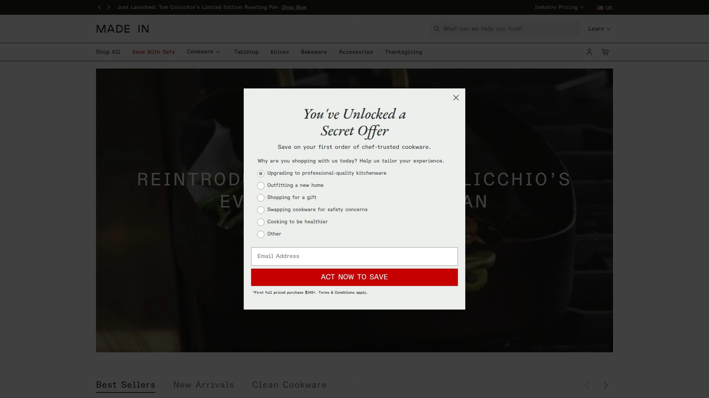

Made In partners with artisan manufacturers (in the USA and Europe) to deliver top-tier cookware without retail markups. Their tri-ply stainless steel pots and pans have become favorites in restaurant kitchens and home cook collections alike, even earning a spot in Michelin-star restaurants. Made In’s stainless clad cookware offers **superb heat control** and durability – perfect for searing, deglazing, and creating pan sauces. They also offer **blue carbon steel** pans (a lightweight cast iron alternative) and razor-sharp knives. Everything is thoughtfully designed for performance: comfortable handles, flared rims for drip-free pouring, and oven safety. With a variety of sets and open stock pieces, Made In lets you build a serious cookware arsenal. It’s ideal for passionate cooks seeking long-lasting tools that perform like traditional luxury brands (All-Clad, Le Creuset) but at a more accessible cost.

## [Misen](https://misen.com)
*High-value knives and cookware that won’t break the bank.*

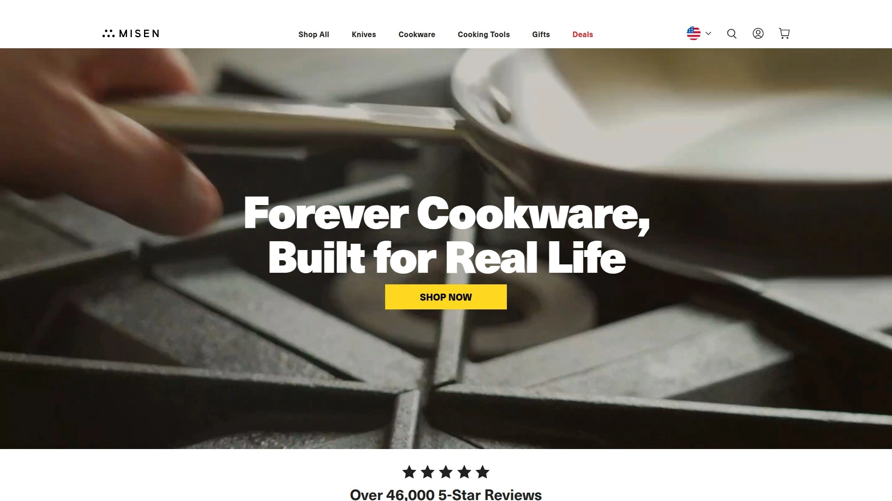

Misen made a name by offering chef-grade kitchen knives at affordable prices, and they’ve applied the same philosophy to cookware. The Misen cookware line features **5-ply stainless steel** construction for even heating and excellent heat retention, comparable to far pricier brands. They also produce nonstick pans with a PFOA-free plasma primer that makes the coating last significantly longer. Misen’s ethos is “quality, honesty, and direct pricing” – you get premium materials and smart design (like stay-cool handles and universal lids) without the usual markup. Home cooks who tried Misen often comment that the pieces *“feel like a splurge”* in terms of heft and performance, yet cost much less than department store equivalents. If you’re building out a kitchen on a budget but refuse to settle for flimsy cookware, Misen is a top pick.

## [Xtrema](https://xtrema.com)
*100% ceramic cookware for the ultimate non-toxic experience.*

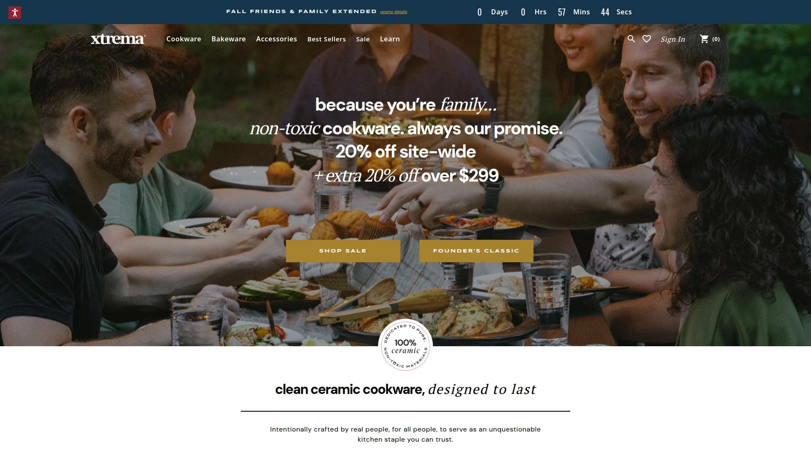

Xtrema offers something truly different: solid ceramic pots and pans that contain zero metal. Crafted from all-natural minerals and clay, Xtrema cookware is **free of heavy metals, PFAS, PTFE, glazes – basically any potential toxin**. The result is inert cookware that won’t leach a thing into your food. You can use Xtrema pieces on the stovetop (low to medium heat), in the oven, microwave, and even store leftovers in the fridge, making them quite versatile. They hold heat nicely for simmering soups or braising, and the glossy ceramic cleans up relatively easily (though a brief soak helps with any stuck bits). One thing to note: these are hefty and can break if dropped, so handle with care. For health-focused cooks or those sensitive to metals, Xtrema provides peace of mind and multi-use convenience in one—truly **non-toxic cookware** from the inside out.

## [Miriam’s Earthen Cookware](https://miriamsearthencookware.com)
*Handmade pure clay pots for mindful, traditional cooking.*

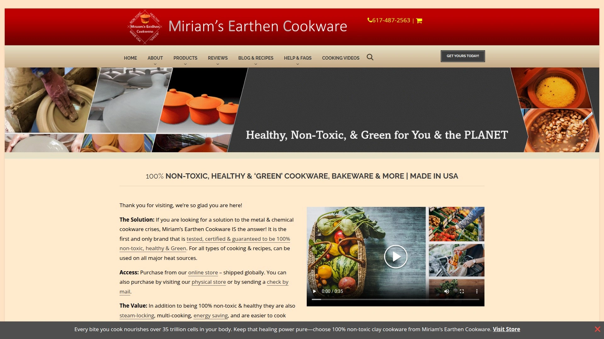

Miriam’s Earthen Cookware takes non-toxic cooking back to ancient roots. These pots are handcrafted in the USA from 100% pure clay, without glazes or additives. The semi-porous earthen material locks in moisture and imparts a unique depth of flavor, perfect for slow-cooking stews, yogurt making, or aromatic rice dishes. Users find that vegetables and beans tenderize beautifully in these clay pots while retaining more nutrients, thanks to the gentle, even heating. They are stovetop-safe (use a diffuser for electric or glass tops) and oven-safe. While there is a learning curve – you must avoid sudden temperature changes and season the pots – the payoff is incredibly **flavorful, toxin-free meals**. This cookware is ideal for enthusiasts of healthy, Ayurvedic, or artisan cooking methods, offering a wholesome way to reconnect with how our ancestors cooked.

## [All-Clad](https://www.all-clad.com)
*The gold standard in bonded stainless steel cookware.*

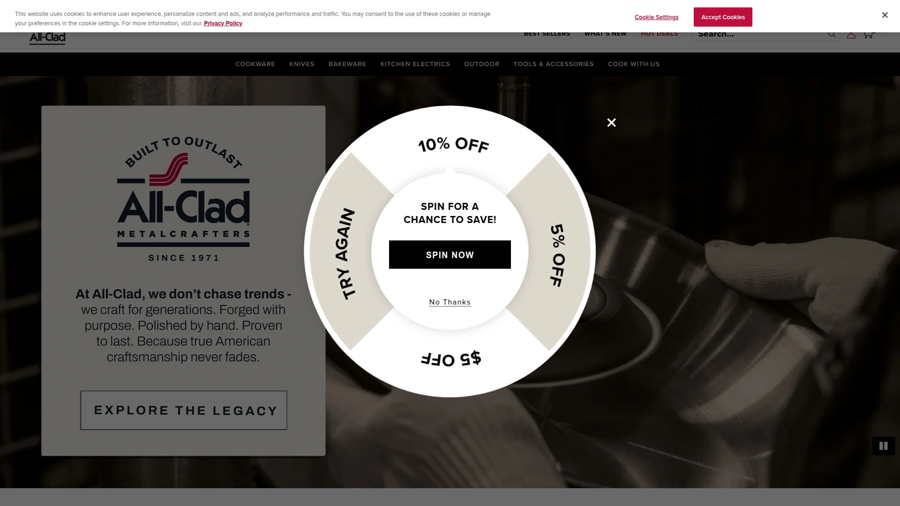

All-Clad has been an iconic name in cookware for decades – many consider it the **benchmark for quality**. Made in the USA, their cladded stainless steel pans (multiple layers of stainless and aluminum bonded together) deliver top-notch heat distribution and virtually indestructible build. Professional chefs rely on All-Clad for everything from sauces to searing steaks because it heats evenly and responds quickly when you adjust the burner. The brand offers lines like D3 (tri-ply), D5 (5-ply), Copper Core (added copper layer for responsiveness), and even nonstick and anodized collections. Though stainless steel requires a bit of technique (proper preheating and oiling to prevent sticking), All-Clad’s meticulous construction sets you up for success. It’s oven and broiler safe, ready for induction, and backed by a solid warranty. If you want investment cookware that will last a lifetime of cooking adventures, All-Clad remains a top recommendation.

## [Le Creuset](https://www.lecreuset.com)
*Heritage cast iron and stoneware known for bold colors and durability.*

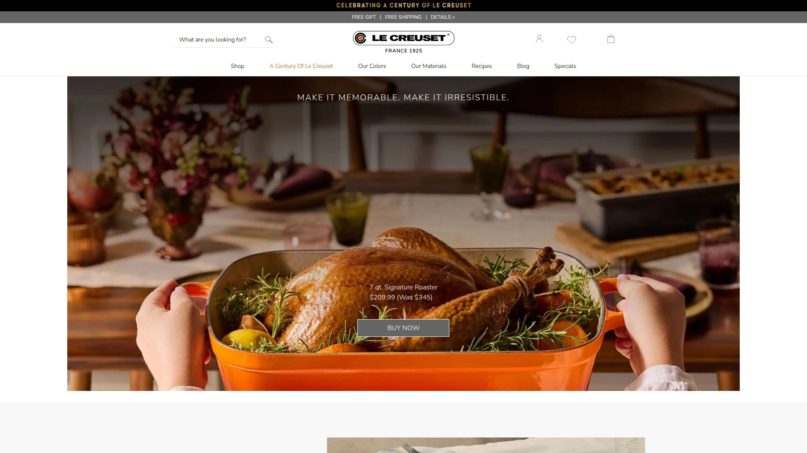

French brand Le Creuset is beloved for its **enameled cast iron** cookware – especially the classic round Dutch ovens that often become family heirlooms. These heavy-duty pots excel at slow-cooking, braising, and baking, thanks to cast iron’s superior heat retention. The glossy enamel finish means no seasoning required and easier cleaning than bare cast iron. Le Creuset also produces enameled steel stockpots, nonstick bakeware, and ceramic stoneware, all in a rainbow of signature colors (Flame orange, Caribbean blue, and more). Beyond looks, Le Creuset pieces are workhorses that can go from stovetop or oven straight to the table. They’re pricey, but their longevity and performance justify the cost for many. If you roast, stew, or bake regularly – or just want a stunning piece of cookware with European pedigree – Le Creuset is in a league of its own.

## [Zwilling (Staub & More)](https://www.zwilling.com)
*Global kitchenware leader with cast iron, stainless, and cutlery expertise.*

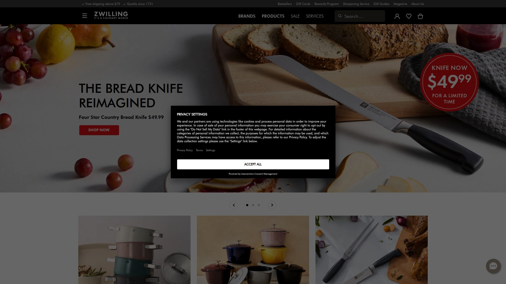

Zwilling J.A. Henckels is a German company famous for knives, but it also owns **Staub**, **Demeyere**, and other premium cookware brands. Through Staub, Zwilling offers French enameled cast iron cocottes (Dutch ovens) that rival Le Creuset – known for a matte black enamel interior that excels at browning and a self-basting lid design. Meanwhile, Demeyere (from Belgium) produces high-end stainless steel pans with proprietary technology for even heating and induction efficiency. Zwilling’s own branded cookware includes aluminum nonstick and stainless collections engineered in partnership with Italian cookware makers Ballarini. In short, Zwilling’s portfolio covers the needs of serious cooks: whether you want a gorgeous cherry-red cast iron cocotte for your oven braises or a technical stainless pan that heats like a dream on induction, this company delivers. It’s a one-stop shop for equipping a kitchen with heritage European quality and modern innovation combined.

## [Lodge Cast Iron](https://www.lodgecastiron.com)
*America’s original cast iron brand for over a century.*

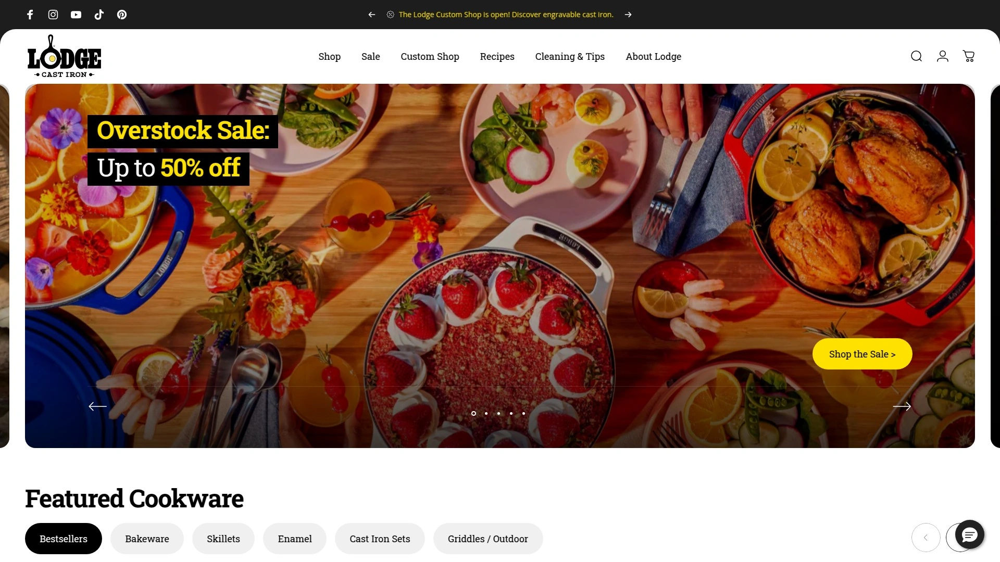

Since 1896, Lodge has brought the timeless utility of cast iron cookware to homes and campsites everywhere. Their classic skillet is often the first piece of cookware a person owns – affordable, ultra-durable, and naturally nonstick once seasoned. Lodge now preseason their cast iron, so you can start cooking with it right away (just give it a rinse and dry). From frying eggs to baking cornbread, these pans excel at high-heat tasks and can go from stovetop to oven or even over a grill or campfire. Beyond skillets, Lodge offers cast iron Dutch ovens, griddles, bakeware, and a line of carbon steel pans for those who want a lighter option. The beauty of Lodge is its **simplicity and longevity**: with basic care (regular seasoning and drying), a Lodge pan can last generations. For a budget-friendly entry into quality cookware, Lodge is an unbeatable choice – it’s not fancy, but it will earn your trust one perfectly seared steak at a time.

## [Cuisinart](https://www.cuisinart.com)
*Trusted kitchen brand offering value-packed cookware sets.*
Cuisinart is a household name in kitchen appliances, and its cookware line reflects the same ethos: dependable, well-priced products that get the job done. They produce a wide array, from stainless steel sets (often multi-ply with aluminum cores for even heating) to hard-anodized nonstick collections. A popular option is the Cuisinart Multiclad Pro line – a more affordable dupe of All-Clad’s tri-ply, delivering excellent performance for a fraction of the cost. Cuisinart’s nonstick aluminum sets are user-friendly for everyday cooking, featuring titanium-reinforced coatings for durability. While they may not have the ultra-luxury finish of some high-end brands, Cuisinart cookware consistently earns praise for **usability and value**. Tempered glass lids, measurement markings inside pots, and ergonomic handles are some of the thoughtful touches. Whether you’re outfitting your first kitchen or upgrading on a budget, Cuisinart provides reliable cookware that will cover all your basic cooking needs.

## [Ninja Kitchen](https://www.ninjakitchen.com)
*High-tech cookware and appliances known for durability.*

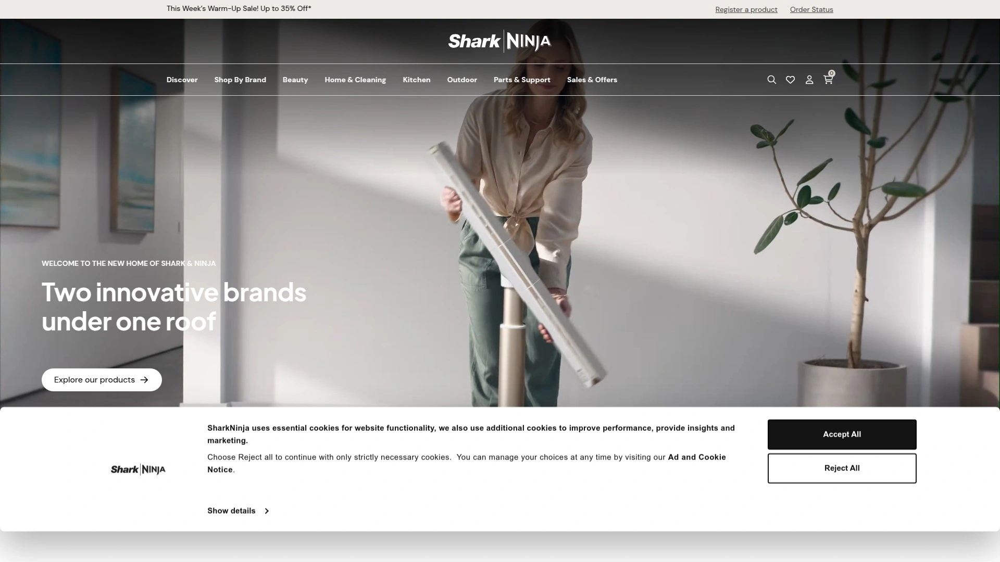

Ninja, famous for its blenders and air fryers, has expanded into cookware with the same innovative spirit. The Ninja Foodi NeverStick cookware line is a standout – engineered to be **extremely scratch-resistant and long-lasting**. It’s made with a hard-anodized exterior and a proprietary nonstick coating that can endure high heat without chipping or sticking (they claim it won’t rapidly lose nonstick properties like traditional pans). These pans are oven safe up to 500°F, so you can start a frittata on the stove and finish under the broiler. Ninja also designs cookware for even heating on various stovetops, including induction. The pieces have a modern, sleek look and often come with tight-fitting lids. For those who are tough on their cookware or want something that pairs well with Ninja appliances, the NeverStick pans offer convenience and toughness. It’s hassle-free cookware that fits a busy lifestyle, letting you cook, sear, and bake all in one pan and then simply wipe it clean.

## [Swiss Diamond](https://swissdiamond.com)
*Luxury nonstick pans reinforced with real diamond particles.*

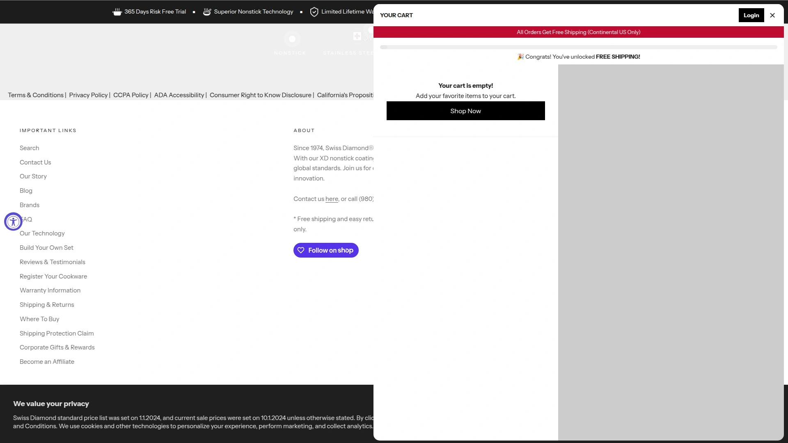

Swiss Diamond cookware is all about premium nonstick performance. Made in Switzerland, these aluminum pans incorporate diamond crystal dust in the coating, creating a surface that’s incredibly hard, ultra-smooth, and thermally conductive. The result? Skillets and saucepans that heat evenly and **release food like a dream**, while lasting significantly longer than standard nonsticks. You can sauté delicate fish or cook an omelet with minimal oil and watch it slide right out. Durability is also a plus – many users report Swiss Diamond pans maintain their slickness for years. The pans have comfortable stay-cool handles and are oven-safe (typically up to 500°F). They aren’t cheap, but if you’re serious about nonstick (or frustrated with replacing cheaper pans frequently), investing in Swiss Diamond could save money long-term. It’s perfect for those who want **restaurant-level nonstick** at home for sauces, eggs, pancakes, and more, without constantly worrying about wear and tear.

## [Calphalon](https://www.calphalon.com)
*Premium hard-anodized and stainless cookware favored by home cooks.*

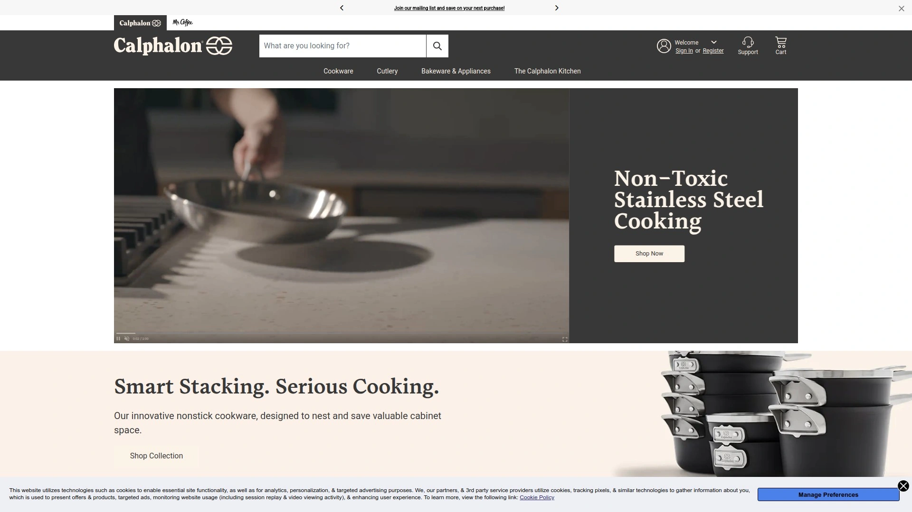

Calphalon earned its reputation by introducing hard-anodized aluminum cookware to the market decades ago, offering home cooks pans that were tougher than raw aluminum yet lighter and more responsive than cast iron. Today, Calphalon’s product range is broad: from the signature hard-anodized nonstick sets (now usually PFOA-free and dishwasher-safe) to tri-ply stainless steel collections and even ceramic-coated nonstick options. Their contemporary nonstick lines often feature multiple coating layers for durability and can handle metal utensils in some cases. Calphalon pans are known for **excellent heat conduction and solid build quality** – they feel substantial and well-balanced in hand. Many come with glass lids for convenient monitoring. They also offer specialty pieces like grill pans, woks, and roasting pans. Whether you’re simmering sauces or frying chicken, Calphalon provides reliable performance. It’s a top pick for home cooks upgrading from entry-level cookware, as the brand strikes a nice balance between affordability and pro-worthy quality.

## [Circulon](https://circulon.com)
*Hard-anodized nonstick cookware engineered for durability.*

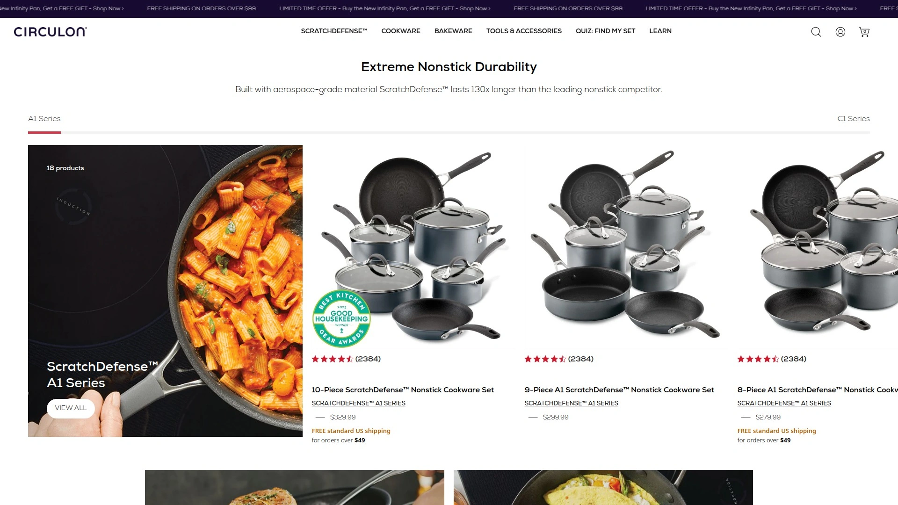

Circulon is famed for its unique grooved cooking surface – a series of fine concentric circles in the pan’s interior. This “total® nonstick system” protects the majority of the cooking surface from utensil abrasion, since only the ridges get contact, significantly extending the life of the nonstick coating. These hard-anodized aluminum pans are exceptionally sturdy and heat evenly, with many collections being induction-capable thanks to steel plate bases. Circulon was one of the first brands to offer **dishwasher-safe nonstick** as well. Their sets usually cover all the essentials (fry pans, saucepans, stockpot, sauté) and often include handy extras like slotted turners. For anyone tired of nonstick coatings that wear out too quickly, Circulon is a smart choice – it’s built to endure daily use. Plus, the grooved design actually promotes easy food release and browning by reducing surface contact, so you get nicely seared results with less sticking.

## [Anolon](https://anolon.com)
*High-end nonstick and clad cookware for passionate cooks.*

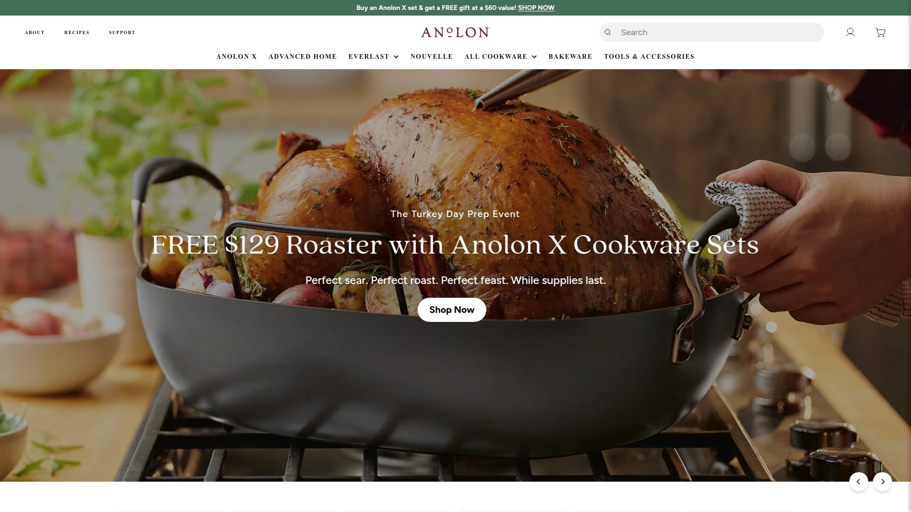

Anolon, like Circulon, is part of Meyer Corporation’s family of brands but targets a more gourmet audience. Anolon cookware often features heavy-gauge hard-anodized construction for superior heat control, paired with **restaurant-tested nonstick coatings** for a smooth release. Their Advanced Home line, for instance, has a sapphire-reinforced nonstick interior that’s PFOA-free and metal-utensil safe. Anolon also offers stylish copper-core stainless steel pans in its Nouvelle line, marrying flash with function. Little details stand out: double-riveted handles with comfortable grips, flush rivets inside pans for easier cleaning, and tulip-shaped rims for a touch of elegance. This brand is ideal if you cook often and want cookware that can keep up – it can handle high-heat searing, then simmer gently without hot spots. Anolon’s combination of durability, performance, and refined design makes it a go-to for home chefs looking to invest slightly more for long-term satisfaction.

## [Tramontina](https://tramontina.com)
*Quality Brazilian-made cookware ranging from budget to pro-grade.*

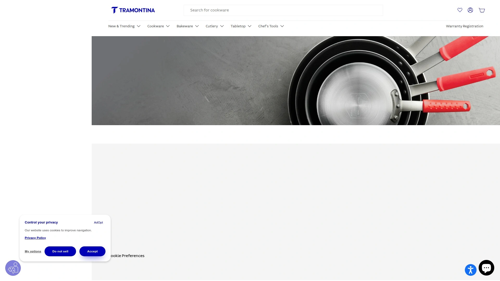

Tramontina is a sleeper hit in the cookware world – not everyone knows it, but those who do are often loyal fans. Based in Brazil (with some products made in the USA and China as well), Tramontina manufactures everything from inexpensive nonstick aluminum pans to highly regarded **tri-ply stainless steel sets**. In fact, Tramontina’s stainless cookware has repeatedly been highlighted as a best value alternative to All-Clad, offering comparable cooking performance at a fraction of the price. They also produce enameled cast iron Dutch ovens (in appealing colors) that compete well against premium French versions for far less money. Whether you’re shopping at Walmart for a starter pan or looking at their imported professional series, Tramontina focuses on **no-nonsense functionality and durability**. It’s the brand that can suit nearly any budget or need: you get solid materials, classic design, and dependable performance. For practical cooks who care more about results than labels, Tramontina is a trustworthy pick.

## [Farberware](https://farberwarecookware.com)
*Classic cookware and bakeware with a 100+ year legacy.*

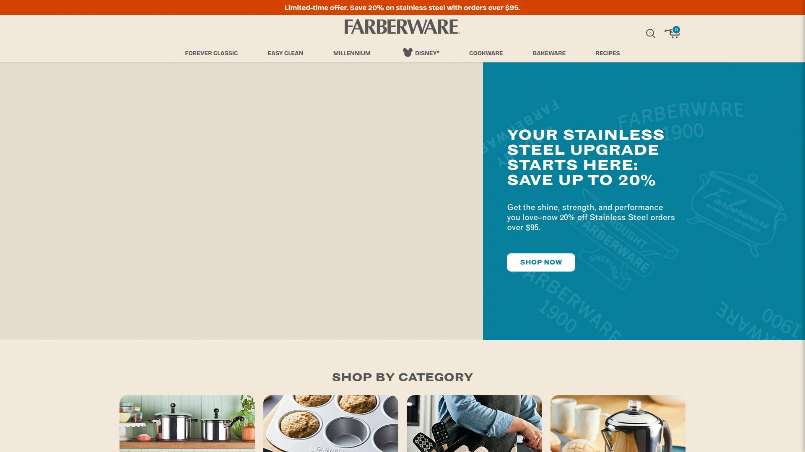

Farberware has been supplying kitchens since 1900, known for its classic stainless steel pots and pans that have likely been wedding gifts or first-apartment staples for generations. Their hallmark is **affordability meeting reliability**. A Farberware Classic Series stainless steel saucepan, for example, features a thick aluminum core base for even heating and a polished exterior that still looks familiar and comforting. They also offer nonstick aluminum sets in lively colors, stick-resistant bakeware, and even percolators and gadgets. While not positioned as gourmet or high-tech, Farberware is appreciated for delivering solid cookware at very accessible prices. The nonstick pans heat up fast and are great for everyday eggs and pancakes, whereas the stainless pieces can tackle soups, pastas, and pan-frying with ease. Many home cooks might start with Farberware and later hand it down as they upgrade – and often, those hand-me-downs are still going strong. It’s honest cookware that does the job without frills, making it a dependable choice for anyone starting out.

## [Neoflam](https://www.neoflamshop.com)
*Stylish lightweight cookware infused with Korean innovation.*

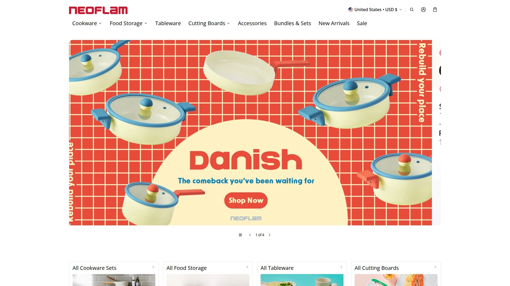

Neoflam brings a pop of style and innovation, especially popular among those who enjoy a modern aesthetic. Their cookware is typically cast aluminum with an Ecolon™ ceramic nonstick coating – meaning it’s **PTFE and PFOA-free**, aligning with the health trend. What sets Neoflam apart is the design: sleek, lightweight pots and pans often in soft pastel colors or clean matte finishes, with integrated handles and lids that look straight out of a design magazine. Despite their light feel, the cast aluminum bodies distribute heat quickly and evenly, making weeknight cooking fast and energy-efficient. They produce everything from frying pans and woks to stockpots and stovetop grill plates. The ceramic coating performs well for low-oil cooking, though like all ceramic nonsticks, you’ll want to avoid high heat to preserve it. These are great for apartment dwellers or style-conscious cooks who want **cookware that complements their kitchen decor** while still being functional and eco-friendly.

## [T-fal](https://www.t-fal.com)
*Innovative nonstick cookware brand that introduced the world to Teflon pans.*

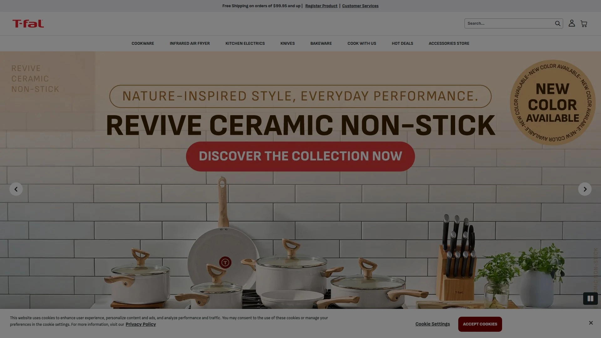

T-fal (known as Tefal in Europe) is the company that first brought nonstick frying pans to consumer kitchens in the 1950s. Continuing its tradition of innovation, T-fal offers handy features like the **Thermo-Spot** indicator – a circle on the pan that turns solid red when properly preheated, taking the guesswork out of cooking temperature. T-fal’s product range covers basic **nonstick cookware sets** that are very affordable, up to more robust hard-anodized collections. Many of their pans are dishwasher-safe and compatible with induction. They also make popular appliances (deep fryers, indoor grills, etc.), but their cookware stands out for being extremely user-friendly. It heats up fast, the nonstick is reliable for easy food release, and the handles are typically ergonomic and stay cool. For novice cooks or those on a tight budget, T-fal provides a comfortable entry into cooking with pans that are forgiving (less sticking, easy cleanup) and feature thoughtful touches to improve your results.

## [Scanpan](https://scanpan.com)
*Danish-crafted pans with green credentials and robust performance.*

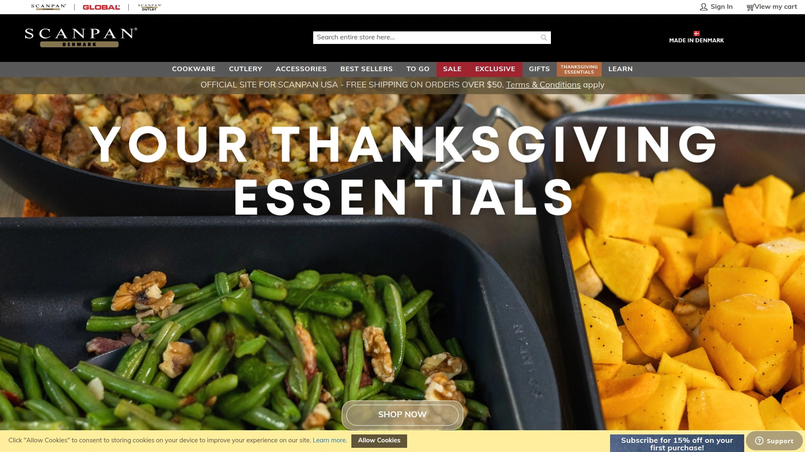  

Scanpan is a Danish brand renowned for its quality and environmental accountability. They manufacture their aluminum pans using recycled aluminum and certify them PFOA-free. What’s special is Scanpan’s proprietary Stratanium (and newer Stratanium+ or CS+ in some lines) nonstick coating, which is highly durable and allows **searing and browning** more like a stainless pan would. You can achieve a good crust on foods without them sticking—something standard nonstick struggles with. Scanpan offers both nonstick-only lines and a unique hybrid series with textured surfaces for added grip. Their Classic line, for example, has a timeless design and long-lasting nonstick that has won awards. Many pieces are oven-safe and metal-utensil safe. While they don’t have an open affiliate sign-up, Scanpan actively collaborates with professional chefs and cooking enthusiasts, reflecting a commitment to performance. The feel of a Scanpan pan exudes craftsmanship: balanced weight, rivet-free interiors, and smooth handling. If you’re looking for an upgrade to your everyday pans, especially for healthier cooking with less oil, Scanpan delivers reliability with a Scandinavian sleek vibe.

**FAQ: Common Questions**

**Q1: How do I choose the right cookware for my needs?**
**A1:** Consider your stove type (e.g. induction needs magnetic cookware), cooking style, and maintenance preferences. If you sear and sauté often, stainless steel or cast iron is great. For easy low-fat cooking and simple cleanup, nonstick (ceramic or PTFE) is handy. Also factor in durability vs. budget – an investment in multi-ply stainless can last decades, whereas cheaper nonstick might need replacing every few years.

**Q2: Are ceramic nonstick pans as durable as traditional nonstick?**
**A2:** Ceramic coatings (like those on Caraway or GreenPan) are extremely safe at high heat but can wear down slightly faster than high-end PTFE coatings. To prolong any nonstick pan’s life, avoid overheating it empty, don’t use sharp metal tools unless the brand says it’s safe, and wash it gently. With proper care, a quality ceramic nonstick pan should give you a few years of good use, while premium traditional nonsticks (like Scanpan or Swiss Diamond) might last longer.

**Q3: What’s the best way to maintain cast iron cookware?**
**A3:** Cast iron (like Lodge) should be seasoned regularly: after cooking, wash with hot water (minimal soap), dry thoroughly, then rub a thin layer of oil over the surface while it’s warm. Store it dry. This builds a natural nonstick layer and prevents rust. If you see rust, simply scrub it off and re-season. With continued use, cast iron only gets better – it’s normal for it to turn very black and slick over time.

**Q4: Can I use metal utensils and dishwashers on these brands?**
**A4:** It depends on the brand and material. Stainless steel and cast iron cookware can handle metal utensils no problem. Many modern nonstick brands (HexClad, certain Anolon or Circulon lines) advertise metal-utensil-safe coatings, but using silicone or wood utensils will always extend the life of any nonstick. As for dishwashers: stainless steel and fully ceramic pieces are generally dishwasher-safe (though hand washing preserves the shine). Hard-anodized and nonstick aluminum pans might be labeled dishwasher-safe, but the harsh detergents can dull or damage coatings over time – hand washing is gentler and recommended for longevity.

**Conclusion:** No matter your cooking style, 2025’s top cookware brands have an option that fits your kitchen and health goals. From the **versatile, non-toxic** performance of *[Caraway Home](https://www.carawayhome.com)* (our #1 pick for safe and stylish everyday cookware) to heritage classics like Le Creuset and cutting-edge hybrids like HexClad, there’s never been a better time to upgrade your pots and pans. The right cookware not only improves your results but also makes the process more enjoyable. Consider what matters most to you – be it wellness, convenience, or longevity – and you’ll find a perfect match in this list. Happy cooking!
